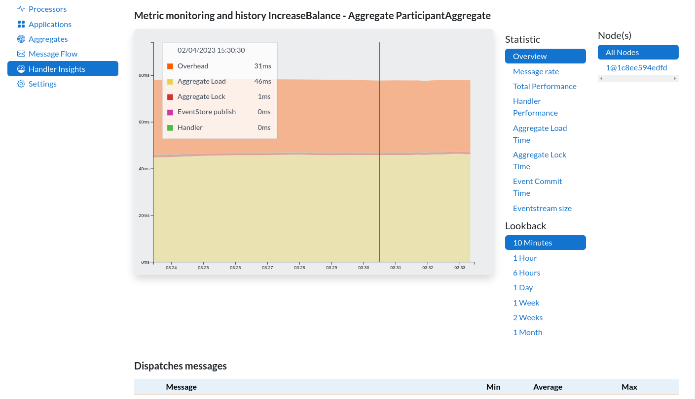

# Axoniq Platform Framework client

Axoniq Platform superpowers your Axon Framework application with advanced monitoring and enabling easy access to actions
within the framework.

This repository contains the Open-Source connectors that your application will use through maven dependencies.
For actual configuration, please consult the setup instructions that will be provided by AxonIQ Console itself.

[You can visit Axoniq Platform here.](https://platform.axoniq.io)

## Spring Boot Starter

### application properties

* `axoniq.console.credentials` - this need to be set, otherwise the auto configuration won't do anything. The correct
  value can be retrieved via the AxonIQ console UI.

## Data sent to AxonIQ

Axoniq Platform is an [AxonIQ](https://axoniq.io) SaaS product. Your application will periodically, or upon request, send
information to the servers of AxonIQ. Please check our [Privacy Policy](https://www.axoniq.io/privacy-policy) and [Data Processing Addendum](https://lp.axoniq.io/axoniq-data-processing-addendum) for the
measures we implemented to protect your data.

The following data will be sent to the servers of AxonIQ:

- Event processor information
  - Name, latency, status, position
  - Occurs every 2 seconds
- Handler statistics
  - Message names and names of handling components
  - Message payload, or ids, are not sent to AxonIQ servers
  - Statistics such as latency, throughput and error rates
  - Correlation between messages and different handlers
  - Occurs every 20 seconds
- Dead Letter Information
  - Contains message name, error information and event payload
  - Occurs upon user request
  - Disabled by default

If you are concerned about the message data being sent to AxonIQ, disabling the DLQ functionality will prevent that in all cases.

## How to Release

1. Run `mvn versions:set -DnewVersion=1.x.x` to update the version in the pom files
2. Commit and push the change
3. Close the milestone on GitHub
4. Wait for the release to be created on Github and publish it
5. A Github action will automatically release this to Maven Central
6. Run `mvn versions:set -DnewVersion=1.x.x-SNAPSHOT`
7. Commit and push the new development version
8. Wait for the version to become available [here](https://repo1.maven.org/maven2/io/axoniq/console/console-framework-client-parent/). Can take minutes, can take hours.
